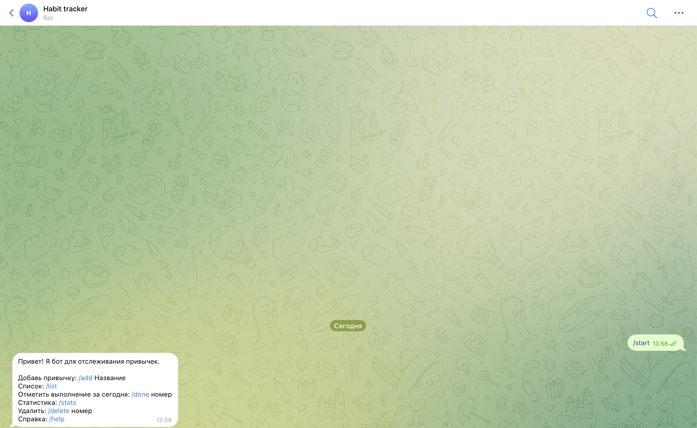
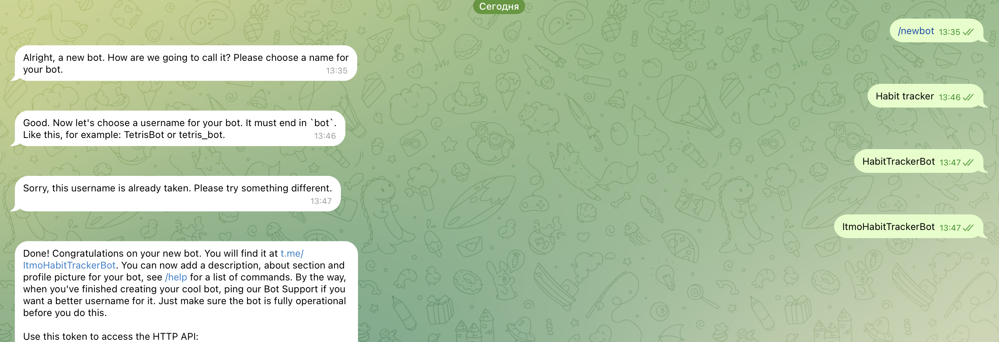
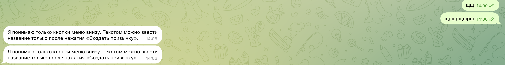
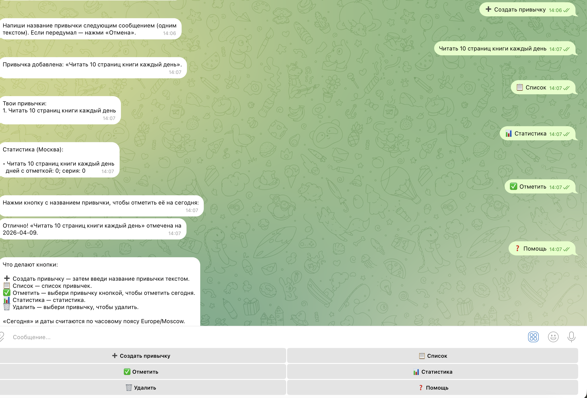

University: [ITMO University](https://itmo.ru/ru/)
Faculty: FTMI
Course: [Vibe Coding: AI-боты для бизнеса](https://github.com/itmo-ict-faculty/vibe-coding-for-business)
Year: 2025/2026
Group: U4125
Author: Semenov Alexey Alexeevich
Lab: Lab1
Date of create: 09.04.2026
Date of finished: 09.04.2026

---

# Отчёт по лабораторной работе 1

## 1. Описание задачи

Telegram-бот — трекер привычек: пользователь добавляет привычки, отмечает выполнение за текущий день, смотрит список и простую статистику, удаляет лишнее. Данные изолированы по `user_id` Telegram.

## 2. Промпт для LLM

Ниже — два этапа работы с моделью: сначала запрос плана без кода, затем запрос реализации по готовому плану.

**Этап 1 — план (без генерации кода):**

```
промпт в два этапа, для плана:

Хочу сделать Telegram-бота-трекер привычек на Python с использованием библиотеки python-telegram-bot.

Задача бота:
- пользователь может добавлять привычки;
- смотреть список своих привычек;
- отмечать привычку как выполненную за сегодня;
- удалять привычки;
- смотреть простую статистику по выполнению.

Команды бота:
- /start
- /help
- /add
- /list
- /done
- /stats
- /delete

Требования:
- бот должен быть простым и понятным;
- использовать JSON-файл для хранения данных;
- добавить обработку ошибок;
- код должен быть читаемым и с понятными комментариями;
- не усложнять архитектуру;
- решение должно подходить для учебной лабораторной работы.

Сейчас не пиши код.
Сначала:
1. кратко опиши концепцию бота;
2. предложи минимальную архитектуру проекта;
3. перечисли файлы, которые нужно создать;
4. распиши пошаговый план реализации;
5. укажи, какие места могут вызвать ошибки;
6. объясни, что именно нужно будет протестировать вручную.

Ответ дай просто, без лишней сложности.
```

**Этап 2 — реализация по плану:**

```
Для работы: 

Теперь реализуй проект по этому плану.

Создай Telegram-бота на Python с использованием библиотеки python-telegram-bot.

Функционал бота:
- /start — приветствие и краткое описание возможностей;
- /help — список команд;
- /add — добавление новой привычки;
- /list — вывод списка привычек пользователя;
- /done — отметка привычки как выполненной за сегодня;
- /stats — вывод простой статистики по привычкам;
- /delete — удаление привычки.

Логика работы:
- у каждого пользователя свой набор привычек;
- данные хранятся в JSON-файле;
- для каждой привычки нужно хранить название, дату создания и список дат выполнения;
- если пользователь пытается отметить несуществующую привычку, бот должен сообщить об ошибке;
- если привычек нет, бот должен писать понятное сообщение;
- бот должен отвечать на русском языке.

Требования:
- бот должен быть простым и понятным;
- код должен быть хорошо прокомментирован;
- использовать JSON для хранения данных;
- добавить обработку ошибок;
- не делать сложную архитектуру;
- код должен быть пригоден для учебной лабораторной работы.

Создай:

1. Файл bot.py с кодом бота
2. Файл requirements.txt с зависимостями
3. Файл README.md с инструкцией по запуску
4. Файл .env.example для примера конфигурации
5. Файл .gitignore
6. Пример структуры data.json, если он нужен

Сначала покажи дерево файлов проекта.
Потом выведи содержимое каждого файла отдельно.
После этого объясни, как запустить проект локально.
```

*Примечание:* после первой версии интерфейса на текстовых командах функциональность была уточнена: в итоговой версии бота управление перенесено на **кнопки** (Reply Keyboard и inline-кнопки выбора привычки), а текстовый ввод используется только для названия новой привычки после нажатия «Создать привычку» — это отражено в коде и скриншотах ниже.

## 3. Скриншоты и демонстрация

Ниже — этапы работы: создание бота в BotFather, первый запуск с командами, промежуточная версия с контролем ввода и финальный вариант с кнопками и справкой.

Создал бота



Первый запуск после генерации кода и подключения токена бота. сразу косяк: неудобно писать вручную команды, делаю улучшение



Вторая итерация: появился контроль ввода



Окончательная итерация: появились кнопки, помощь



**Видео с демонстрацией работы:** *(https://drive.google.com/file/d/1MQCF2l3GKZlF7ehAUmDzxuJHFF9MwI4V/view?usp=sharing*

## 4. Стек технологий и структура проекта

| Компонент | Назначение |
|-----------|------------|
| **Python 3** | Язык реализации бота |
| **python-telegram-bot** (v21) | Работа с Telegram Bot API, long polling, обработчики команд, сообщений и callback |
| **python-dotenv** | Загрузка `BOT_TOKEN` из файла `.env` без хранения секрета в коде |
| **JSON** (`data.json`) | Персистентное хранение привычек и отметок по `user_id` |
| **zoneinfo (`Europe/Moscow`)** | Единое понимание «сегодня» для отметок и статистики |

Структура репозитория: `bot.py` (логика и хранение), `requirements.txt`, `README.md`, `.env.example`, `.gitignore`, отчёт в `lab1/lab1_report.md`. Токен задаётся только локально в `.env` (в git не попадает).

## 5. Трудности и решения

Трудность только в том, что описал не до конца функциональность и пришлось делать итерации по доработке

Дополнительно по ходу работы:

- **Неполное ТЗ в первой итерации** — после запуска стало очевидно, что ввод команд вручную неудобен; решение: уточнить сценарий и перейти к кнопочному интерфейсу и пошаговому вводу названия привычки.
- **Согласование промпта с финальным UX** — в отчёте сохранены исходные формулировки промптов; фактическое поведение бота (кнопки, `ConversationHandler` для режима ввода названия) описано в репозитории и в разделе 3.

## 6. Выводы

В ходе лабораторной работы получен работающий Telegram-бот для учёта привычек с хранением в JSON и разделением данных по пользователям. Практика показала, что качество постановки задачи для LLM сразу влияет на удобство продукта: первая версия потребовала осмысленных итераций по интерфейсу. Использование готовой библиотеки `python-telegram-bot` и переменных окружения для токена позволило сфокусироваться на логике и сценарии взаимодействия, не усложняя архитектуру. В результате зафиксированы навыки промптинга, пошаговой доработки бота и оформления отчёта по требованиям курса.
