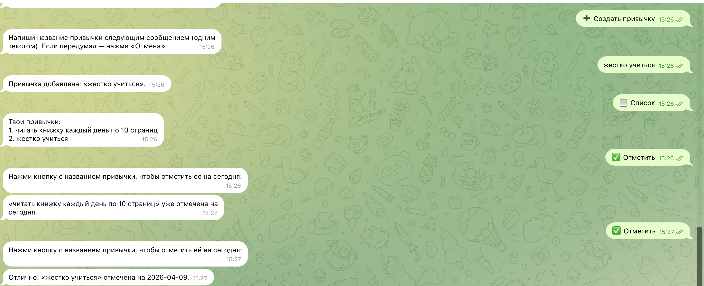
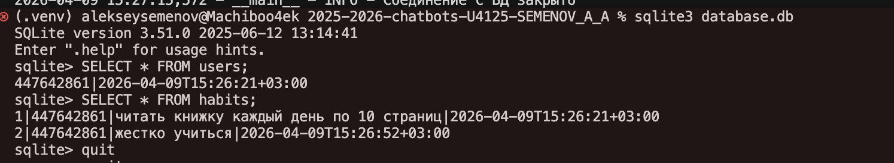
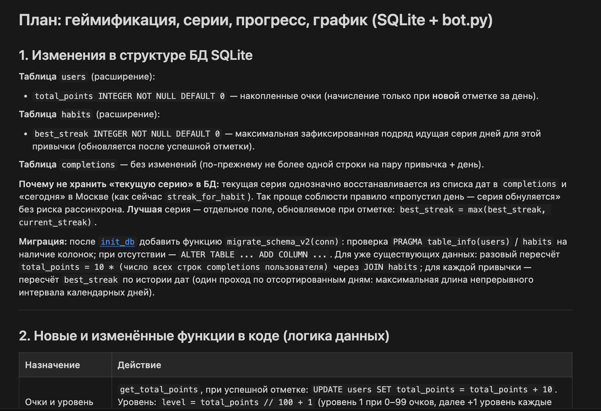
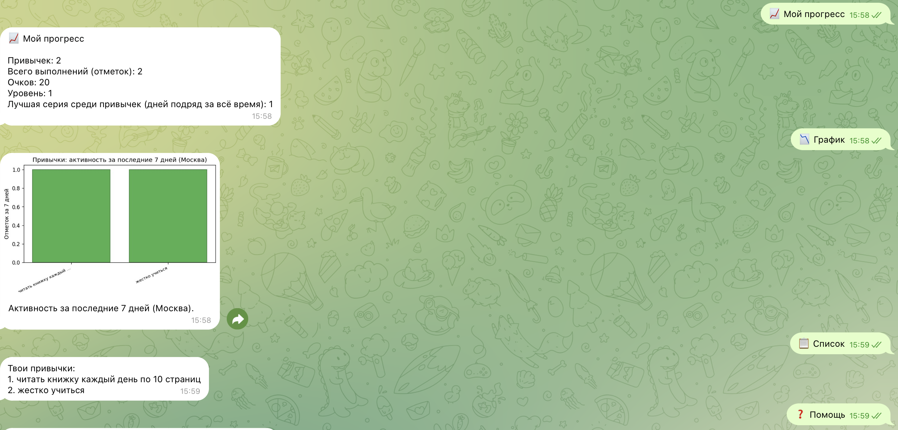
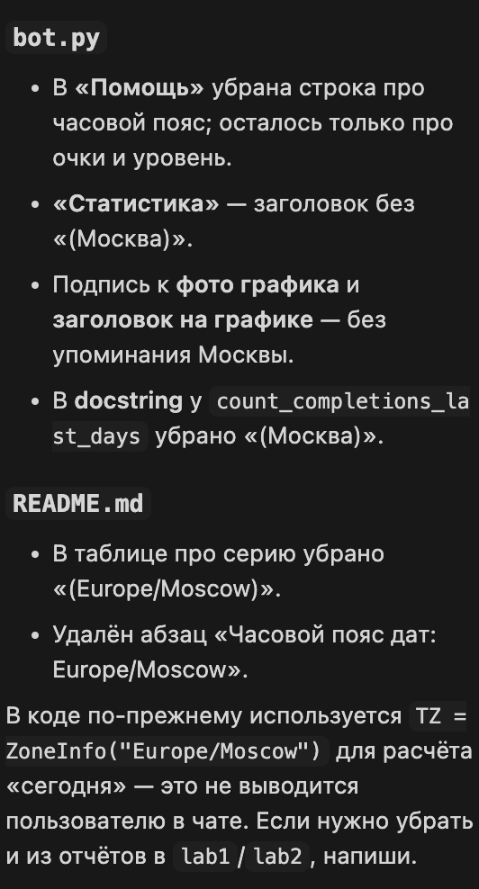

University: [ITMO University](https://itmo.ru/ru/)
Faculty: FTMI
Course: [Vibe Coding: AI-боты для бизнеса](https://github.com/itmo-ict-faculty/vibe-coding-for-business)
Year: 2025/2026
Group: U4125
Author: Semenov Alexey Alexeevich
Lab: Lab2
Date of create: 09.04.2026
Date of finished: 09.04.2026

---

# Отчёт по лабораторной работе 2

## 1. Описание интеграции

Цель работы — перевести трекер привычек с хранения в **JSON** на **SQLite**: пользователи Telegram, привычки и история отметок по дням хранятся в реляционной базе. Интерфейс бота (кнопки, сценарии) сохранён; расширена **статистика**: общее число отметок по каждой привычке, число отметок **за последние 7 календарных дней** (включая сегодня), а также **серия** подряд идущих дней с отметками (как и в первой версии). Выбран **SQLite** как встроенная в Python база без отдельного сервера — достаточно для учебного проекта и деплоя одним файлом `database.db`.

## 2. Промпт для LLM

Ниже — запросы к модели: сначала план перехода с JSON на SQLite, затем задание на реализацию лабораторной 2 в репозитории.

**Планирование (без кода):**

```
Не пиши код.

Помоги спланировать переход моего Telegram-бота привычек с JSON на SQLite.

Нужно:
- предложить структуру БД;
- описать, какие функции нужны;
- как переписать текущую логику;
- какие команды изменятся;
- какие ошибки могут возникнуть;
- как протестировать.

Ответ дай как пошаговый план.

----------
Улучши моего Telegram-бота, добавив работу с базой данных SQLite.

Текущий функционал бота:
- Бот является трекером привычек;
- Пользователь может добавлять привычки;
- Смотреть список своих привычек;
- Отмечать выполнение привычек;
- Удалять привычки;
- Смотреть простую статистику;
- Данные сейчас хранятся в JSON.

Новый функционал:
- Перенести хранение данных из JSON в SQLite;
- Хранить пользователей, привычки и историю выполнения в базе данных;
- Добавить возможность получать статистику по привычкам за последние 7 дней;
- Добавить более точную статистику выполнения (количество выполнений);

Данные:
Использовать SQLite базу данных.

Структура таблиц:
как в плане

Требования:
- Код должен быть простым и понятным;
- Добавить обработку ошибок;
- Хорошие комментарии в коде;
- Сохранить существующий функционал бота;
- Не усложнять архитектуру (всё в одном файле допустимо);
- Использовать стандартную библиотеку sqlite3;

Создай:

1. Обновленный bot.py
2. Файл database.db (или код для его создания)
3. Обновленный README.md
```

## 3. Схема базы данных

Таблицы (логическая модель):

- **`users`** — `telegram_id` (PRIMARY KEY), `created_at` (ISO-время регистрации в боте).
- **`habits`** — `id` (AUTOINCREMENT), `user_id` → `users(telegram_id)`, `name`, `created_at`.
- **`completions`** — связь «привычка — день»: `habit_id` → `habits(id)` с **ON DELETE CASCADE**, поле `day` в формате `YYYY-MM-DD`, первичный ключ `(habit_id, day)` (не более одной отметки за сутки на привычку).

Включены внешние ключи (`PRAGMA foreign_keys = ON`); при удалении привычки строки в `completions` удаляются автоматически.

*В финальной версии бота к схеме добавлены поля геймификации (`total_points` у пользователя, `best_streak` у привычки) — см. репозиторий.*

## 4. Реализация

- Вся логика доступа к данным сосредоточена в **`bot.py`**: функции `init_db`, запросы на выборку/вставку/удаление, опционально **`migrate_from_json_if_needed`** при наличии старого `data.json` и пустой таблицы `habits`.
- Соединение с БД хранится в **`context.bot_data['db']`**, создаётся при старте приложения, при завершении процесса закрывается.
- Отметка за день: `INSERT` в `completions`; повтор за тот же день перехватывается по **`IntegrityError`** (уникальность пары).
- Статистика за 7 дней: `COUNT` по `completions` с условием на диапазон дат от начала семидневного окна до текущей даты (как в коде бота).

_Ключевые фрагменты кода см. в репозитории в файле `bot.py`._

## 5. Тестирование

Рекомендуемые ручные проверки:

- Первый запуск: создаётся `database.db`, бот отвечает на `/start` и кнопки.
- Создание нескольких привычек, список, отметка на сегодня, повторная отметка в тот же день — ожидаемое сообщение об отказе.
- «Статистика»: ненулевые «всего отметок», «за 7 дней», согласованность с фактическими отметками.
- Удаление привычки — исчезновение из списка и обнуление связанной статистики.
- Два разных пользователя Telegram — изоляция данных.
- При наличии резервной копии `data.json` с лабы 1 — проверка однократной миграции (по желанию).

**Запись демонстрации работы бота (видео):** [lab2.mov на Google Drive](https://drive.google.com/file/d/1ZmsmGEeYp_DIWRXX7RxrzNRumlQS_EQL/view?usp=sharing)

## 6. Ход работы и скриншоты

### 1) Промпты и запуск

были написаны промпты выше и запущены



### 2) Проверка базы данных

бд работает, записи есть



### 3) План геймификации

Не устраивает то, что текущий бот мало что предлагает, решаю составить план и ввести геймификацию



**Промпт к модели:**

```
Улучши моего Telegram-бота-трекер привычек, который уже работает и использует SQLite для хранения данных.

Текущий функционал бота:
- создание привычки;
- удаление привычки;
- отметка привычки как выполненной;
- защита от повторной отметки одной и той же привычки в один день;
- просмотр списка привычек;
- базовая статистика;
- кнопки для основных действий;
- все данные уже сохраняются в SQLite.

Нужно добавить новые функции, не ломая текущий функционал и не усложняя архитектуру.

Новый функционал:

1. Геймификация
- За каждое выполнение привычки начислять 10 очков.
- Хранить общее количество очков пользователя.
- Добавить уровни: каждые 100 очков = новый уровень.
- После отметки привычки бот должен писать:
  - что привычка успешно отмечена;
  - сколько очков начислено;
  - сколько очков у пользователя всего;
  - какой у него сейчас уровень.

2. Серии выполнения
- Для каждой привычки считать текущую серию дней подряд.
- Для каждой привычки считать лучшую серию.
- После отметки привычки бот должен показывать текущую серию и лучшую серию.
- Если день пропущен, серия должна сбрасываться.
- Повторная отметка в тот же день по-прежнему должна быть запрещена.

3. Экран прогресса пользователя
- Добавить отдельную кнопку или команду "Мой прогресс".
- В этом разделе показывать:
  - общее количество привычек;
  - общее количество выполнений;
  - количество очков;
  - текущий уровень;
  - лучшую серию среди всех привычек.

4. Расширенная статистика за 7 дней
- Показывать, сколько раз каждая привычка была выполнена за последние 7 дней.
- Показывать самую активную привычку.
- Показывать привычку с наименьшим количеством выполнений за последние 7 дней.
- Если данных нет, выводить понятное сообщение на русском языке.

5. График прогресса
- Добавить команду или кнопку "График".
- Бот должен строить простой столбчатый график за последние 7 дней:
  - по оси X — названия привычек;
  - по оси Y — количество выполнений за последние 7 дней.
- График нужно строить через matplotlib.
- График должен сохраняться во временный файл или в память и отправляться пользователю как изображение в Telegram.
- После отправки временные файлы нужно корректно удалять, если они создаются.
- Если по привычкам нет данных за последние 7 дней, бот должен выводить понятное сообщение вместо построения пустого графика.

Требования:
- Сохранить существующий функционал.
- Не переписывать проект с нуля.
- По возможности не менять текущую архитектуру радикально.
- Код должен быть простым и понятным.
- Добавить понятные комментарии.
- Использовать SQLite и текущую структуру проекта как основу.
- Добавить обработку ошибок.
- Все ответы бота должны быть на русском языке.
- Если нужны новые зависимости, обнови requirements.txt.
- Обнови README.md с описанием новых функций.

Сначала не пиши весь код сразу.

Сначала:
1. Опиши, какие изменения нужно внести в структуру базы данных SQLite.
2. Опиши, какие новые функции нужно добавить.
3. Объясни, как будет считаться серия, очки и уровень.
4. Объясни, как будет строиться и отправляться график в Telegram.
5. Покажи краткий план изменений по файлам.

После этого перейди к коду.

При генерации кода:
- покажи сначала, какие участки нужно добавить или изменить;
- затем выведи полный обновленный bot.py;
- затем обновленный requirements.txt;
- затем обновленный README.md.
```

### 4) Тест новой функциональности




### 5) Уточнение текстов интерфейса

Убираю Гео, ибо лишняя инфа



## 7. Трудности и решения

- **Миграция с JSON на SQLite:** нужно было не потерять старые данные при первом запуске с новым кодом; помогла функция переноса из `data.json`, если таблица привычек пуста, и аккуратное создание схемы через `CREATE TABLE IF NOT EXISTS`.

- **Доработка схемы под геймификацию:** добавление колонок `total_points` и `best_streak` в уже существующую `database.db` без пересоздания файла — через `ALTER TABLE` и одноразовый пересчёт при первом обнаружении новых полей, чтобы не обнулять очки при каждом запуске.

- **`sqlite3` и асинхронные хендлеры:** запросы к БД синхронные; использовано одно соединение с `check_same_thread=False` и короткие транзакции; для отметки с начислением очков — явная транзакция (`BEGIN` / `COMMIT` / откат при ошибке).

- **Повторная отметка за тот же день:** защита через уникальный ключ `(habit_id, day)` и обработка `IntegrityError`, без лишних очков.

- **График matplotlib:** неинтерактивный backend `Agg`, сохранение во временный файл, отправка фото в чат и удаление файла после отправки; при отсутствии данных за 7 дней — текст вместо пустого графика.

- **Формулировки в интерфейсе:** убраны лишние для отчёта упоминания геолокации и часового пояса в сообщениях бота; логика расчёта дат в коде сохранена.

## 8. Выводы

Переход на **SQLite** дал структурированное хранение пользователей, привычек и отметок, проще проверять целостность и строить запросы (в том числе за скользящее окно 7 дней). Отдельная таблица **`completions`** удобно моделирует «один факт выполнения в конкретный день» и хорошо сочетается с геймификацией и графиками.

Итеративная работа с LLM (план → SQLite → план геймификации → код) показала, как уточнять требования по ходу: сначала данные, затем мотивация и наглядность (очки, уровни, график). Для **лабораторной работы 3** логичным продолжением будет деплой бота в облако с сохранением файла БД или резервным копированием, чтобы пользователи не теряли прогресс при перезапуске сервиса.
