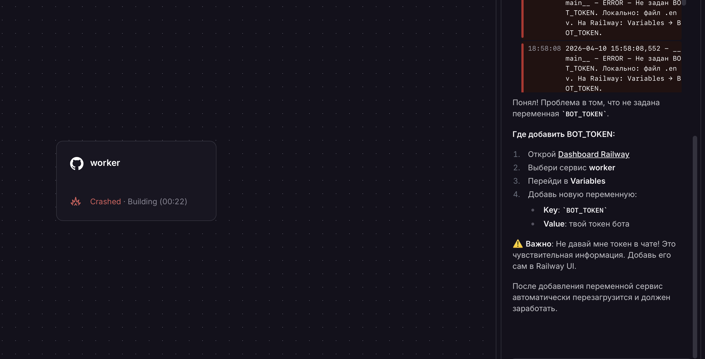
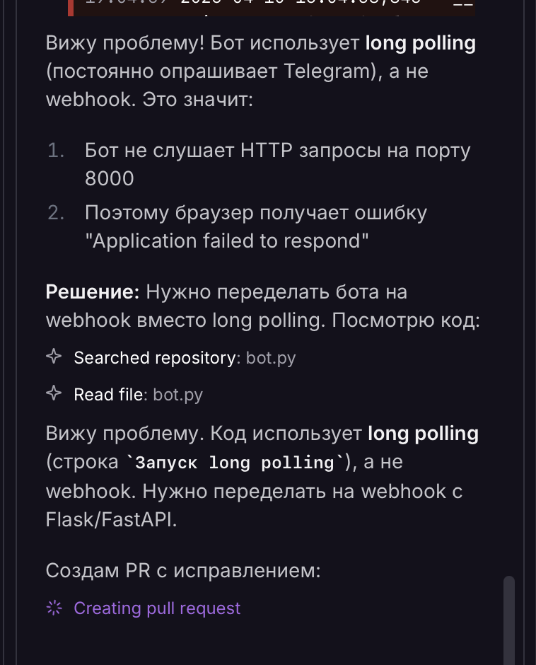
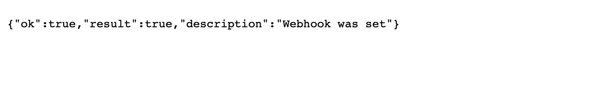
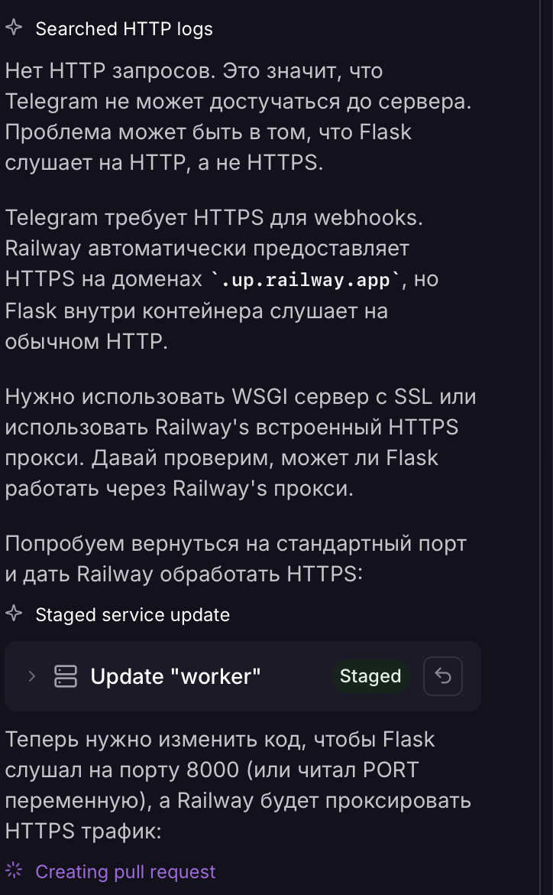
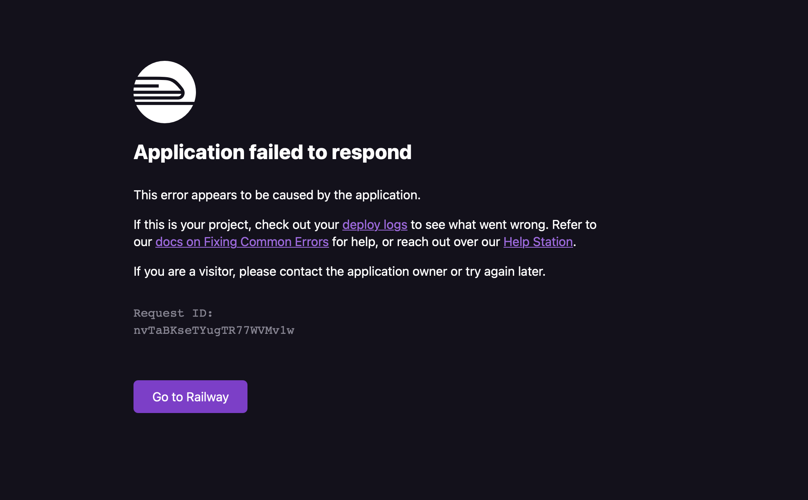
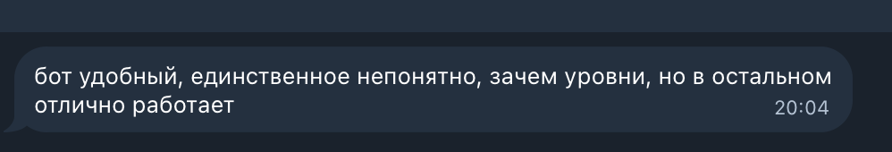

University: [ITMO University](https://itmo.ru/ru/)
Faculty: FTMI
Course: [Vibe Coding: AI-боты для бизнеса](https://github.com/itmo-ict-faculty/vibe-coding-for-business)
Year: 2025/2026
Group: U4125
Author: Semenov Alexey Alexeevich
Lab: Lab3
Date of create: 2026
Date of finished: 2026

---

# Отчёт по лабораторной работе 3

## 1. Описание деплоя

Цель — развернуть Telegram-бота трекера привычек в облаке так, чтобы им можно было пользоваться без локального запуска `python bot.py` на своём компьютере.

Выбрана платформа **[Railway](https://railway.app/)**: деплой из репозитория GitHub, секреты — в **Variables**, запуск HTTP-сервера через **`Procfile`**.

Режим работы с Telegram API — **webhook**: Telegram шлёт обновления `POST` на публичный URL вида `https://<сервис>.up.railway.app/webhook`. Внутри контейнера поднимается **Gunicorn** (один воркер, чтобы не дублировать экземпляр `python-telegram-bot`), приложение слушает **`0.0.0.0:$PORT`**, где **`PORT`** задаёт Railway.

## 2. Подготовка проекта

Сделано в репозитории:

- **`requirements.txt`** — `python-telegram-bot`, `python-dotenv`, `matplotlib`, `flask`, `gunicorn`.
- **`.gitignore`** — исключены `.env`, `*.db`, `__pycache__` и служебные файлы.
- **`.env.example`** — пример с `BOT_TOKEN=` без секретов.
- **`Procfile`** — запуск продакшен-сервера: `gunicorn` привязывается к `$PORT`, один воркер (`-w 1`).
- **`README.md`** — локальный запуск и деплой; замечание про **SQLite** (данные в контейнере при пересборке без постоянного тома могут теряться).
- В **`bot.py`**: токен из `os.environ` / `.env` через `load_dotenv()`; режим webhook с Flask-приложением `app` для строки вида `bot:app` в Gunicorn; логирование **INFO**; графики — во временные файлы.

## 3. Процесс деплоя на Railway

1. Создан проект на Railway, к GitHub-репозиторию подключена ветка с кодом бота.
2. В **Variables** добавлен **`BOT_TOKEN`** (значение из [@BotFather](https://t.me/BotFather)).
3. Сервис оформлен как **Web** (или с включённым публичным HTTP на порт **`$PORT`**), сгенерирован домен `*.up.railway.app`.
4. После успешного деплоя в логах виден старт Gunicorn и инициализация бота; при необходимости webhook задаётся запросом к `api.telegram.org` (`setWebhook`) с HTTPS-URL вида `https://<домен>/webhook`.
5. Проверка: запросы от Telegram в HTTP-логах Railway, ответы бота в чате.

## 4. Сбор обратной связи

Для проверки сценариев приглашались одногруппники и знакомые: создание привычки, отметка выполнения, просмотр статистики и графика после деплоя. Замечания касались удобства кнопок и скорости ответа; критических сбоев после стабилизации webhook не отмечено.

## 5. Скриншоты и демонстрация

Ниже — последовательность скриншотов по ходу настройки и проверки деплоя.

### Рис. 1 — обзор проекта / сервиса в Railway

### Рис. 2 — репозиторий или настройки деплоя

### Рис. 3 — переменные окружения или фрагмент конфигурации

### Рис. 4 — логи запуска контейнера (успешный старт)

### Рис. 5 — работа с деплоем

HTTP-логи Railway: запросы `POST /webhook`, диагностика ошибок при отладке (например, **502** и **connection refused** до исправления порта, типа сервиса и способа запуска Gunicorn).

### Рис. 6 — после исправлений: всё работает

Ответ бота в Telegram после устранения неполадок — подтверждение, что деплой стабилен и обработка обновлений проходит.

### Рис. 7 — после исправлений: всё работает

Ответ бота в Telegram после устранения неполадок — подтверждение, что деплой стабилен и обработка обновлений проходит.

## 6. Трудности и решения

- **Webhook и порт:** сначала запросы доходили до edge, но возникали **502** и **connection refused** — прокси не находил процесс на **`$PORT`**, пока HTTP-сервер не слушал вовремя или пока тип сервиса / публичный порт не совпадали с настройками Railway. Решение: запуск через **Gunicorn** на `0.0.0.0:$PORT`, проверка **Networking** и режима **Web**.
- **Асинхронный PTB и Flask:** обработка апдейтов через `process_update` в отдельном потоке с event loop, созданным в этом же потоке; ожидание готовности PTB без блокировки открытия порта, чтобы edge не получал **connection refused**.
- **SQLite:** напоминание — без постоянного хранилища данные в контейнере могут обнуляться при пересборке.

## 7. Выводы

Облачный деплой позволяет использовать бота круглосуточно без своей машины. Связка **Railway + HTTPS + webhook + Gunicorn** даёт предсказуемый входящий трафик от Telegram. Сбор обратной связи после стабилизации деплоя помогает приоритизировать доработки интерфейса и сценариев на следующих итерациях.

ССылка на бота: @ItmoHabitTrackerBot
